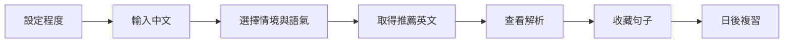

# 我想說這句｜Say This

一款把使用者生活中真正想說的中文，轉換成符合英文程度、使用情境與語氣的自然英文，並透過解析、收藏及複習協助使用者真正學會表達的英文學習產品。

## 核心問題

許多英文學習者遇到需要表達的情境時，會先用中文思考，再使用翻譯工具取得一句英文。現有工具雖然能完成當下翻譯，卻經常出現三個問題：

1. 結果可能太難或太簡單，不符合使用者程度。
2. 使用者不知道不同情境與語氣應該怎麼調整說法。
3. 查過的句子沒有被整理與複習，下次仍需重新查詢。

## 解決方式

使用者輸入想說的中文，選擇情境與語氣後，系統依個人英文程度提供：

- 符合程度的推薦說法
- 基礎版、自然版與精準版三種表達
- 單字、片語、句型與語氣解析
- 發音播放與跟讀練習
- 個人句子庫與間隔複習

## 目標使用者

- 學過英文，但在真實情境中仍不知道怎麼自然表達的成人學習者
- 經常使用翻譯工具，卻無法累積成長期語言能力的人
- 希望學習內容能與工作、旅行、社交及日常生活直接連結的人

## MVP 核心流程

## 開發藍圖

- [產品定義書](docs/product-definition.md)
- [User Story](docs/user-stories.md)
- [功能規格表](docs/feature-spec.md)
- [架構圖與資料模型](docs/architecture-data-model.md)
- [狀態流與畫面示意](docs/state-flow-wireframes.md)
- [素材清單與 MVP 範圍](docs/assets-scope.md)
- [六個介面：一次生成線稿與 Stitch Prompt](docs/interface-prompts.md)

## 專案狀態

目前為產品規劃與原型階段，尚未進入正式開發。
