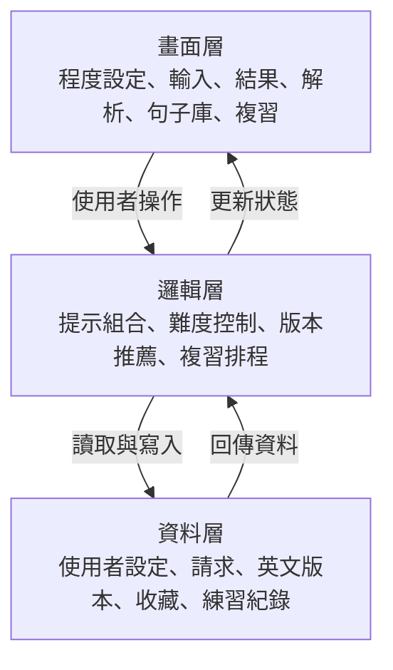
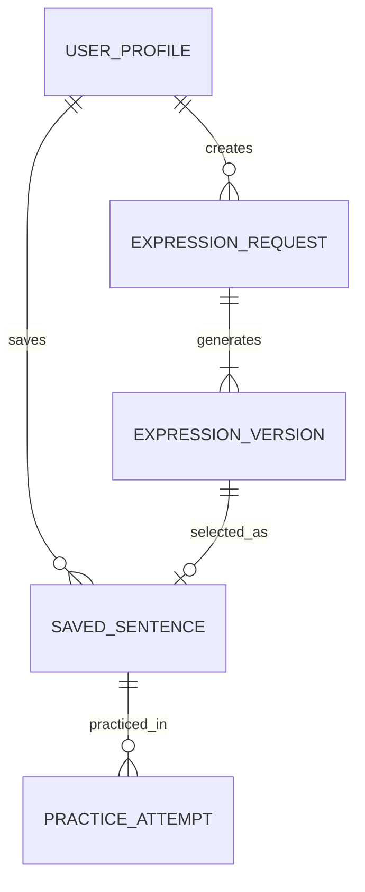

# 架構圖與資料模型

## 三層式架構

## 邏輯流程

1. 讀取使用者的預設英文程度。
2. 接收中文內容、情境與語氣。
3. 組成受限制的 AI 請求，要求保留原意並產生三種版本。
4. 依程度選出推薦版本。
5. 產生對應程度的單字、片語、句型與語氣解析。
6. 使用者選擇版本後，才寫入句子庫。
7. 複習系統依收藏內容產生題目並更新熟悉度。

## 資料模型

### user_profiles

| 欄位 | 說明 |
|---|---|
| id | 使用者識別碼 |
| level | beginner／intermediate／advanced |
| default_context | 預設情境 |
| default_tone | 預設語氣 |
| created_at | 建立時間 |
| updated_at | 更新時間 |

### expression_requests

| 欄位 | 說明 |
|---|---|
| id | 請求識別碼 |
| user_id | 所屬使用者 |
| chinese_text | 使用者輸入的中文 |
| context | 日常／工作／旅行／社交 |
| tone | 自然／正式／禮貌／輕鬆 |
| level_snapshot | 產生當下的程度 |
| created_at | 產生時間 |

### expression_versions

| 欄位 | 說明 |
|---|---|
| id | 版本識別碼 |
| request_id | 對應請求 |
| version_type | basic／natural／precise |
| english_text | 英文內容 |
| explanation | 使用時機與語氣說明 |
| vocabulary | 重點單字與片語 |
| sentence_pattern | 句型解析 |
| is_recommended | 是否為推薦版本 |

### saved_sentences

| 欄位 | 說明 |
|---|---|
| id | 收藏識別碼 |
| user_id | 所屬使用者 |
| version_id | 使用者選定的英文版本 |
| familiarity | new／learning／familiar |
| next_review_at | 下次複習時間 |
| created_at | 收藏時間 |

### practice_attempts

| 欄位 | 說明 |
|---|---|
| id | 作答識別碼 |
| saved_sentence_id | 對應收藏句子 |
| practice_type | translation／cloze／reorder |
| is_correct | 是否答對 |
| answered_at | 作答時間 |

## 關聯

