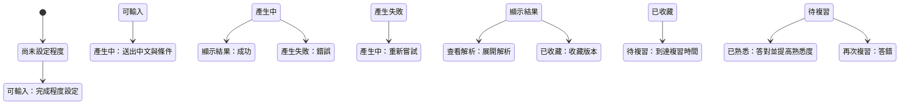

# 狀態流與畫面示意

## 主要狀態流

## 畫面一：程度設定

**目標：**讓不熟悉 CEFR 的使用者也能選擇適合自己的程度。

- 標題：你的英文目前比較接近哪一種？
- 入門：能理解常見單字與簡單句子
- 中階：能應付日常對話並表達完整想法
- 進階：能處理較複雜的內容與語氣
- 主要按鈕：開始使用

## 畫面二：輸入首頁

**目標：**快速說明「這句中文要在哪裡、對誰說」。

- 大型中文輸入框：你現在想用英文說什麼？
- 情境選擇：日常／工作／旅行／社交
- 語氣選擇：自然／正式／禮貌／輕鬆
- 顯示目前程度，可快速調整
- 主要按鈕：看看英文怎麼說

## 畫面三：結果頁

**目標：**先給一個清楚答案，避免一次顯示太多資訊。

- 標籤：推薦給你的說法
- 英文主句
- 簡短中文意思
- 版本切換：基礎版／自然版／精準版
- 主要操作：聽發音、查看解析、收藏
- 重新調整：換個語氣／說簡單一點

## 畫面四：解析頁

**目標：**讓使用者理解，而非只複製答案。

- 重要單字與片語
- 句型結構
- 為什麼這樣說
- 這句適合在哪些場合使用
- 與另外兩個版本的差異

## 畫面五：我的句子庫

**目標：**保存與再次找到真正會用到的英文。

- 搜尋欄
- 篩選：情境、熟悉度、收藏時間
- 每張卡片顯示中文、英文、情境與熟悉度
- 操作：查看、編輯備註、開始複習、刪除

## 畫面六：複習頁

**目標：**把查過的句子轉化成能主動使用的英文。

- 題型：中翻英／填空／句子重組
- 顯示目前進度
- 送出後顯示正確答案與解析
- 自評：還不熟／有點熟／已熟悉
- 答錯時標示下次會再次出現

## 畫面設計原則

1. 一頁只突出一個主要任務。
2. 結果頁先顯示推薦句，不把所有解析同時攤開。
3. 基礎、自然、精準代表表達目的，不鼓勵無意義地堆疊難字。
4. 使用者隨時知道目前採用的程度、情境與語氣。
5. 產生失敗時保留原始輸入與已選條件。

